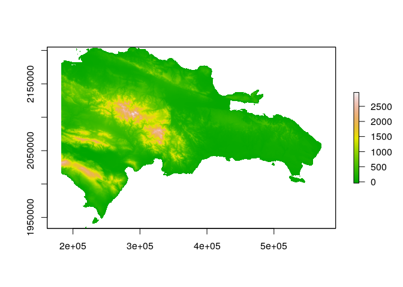
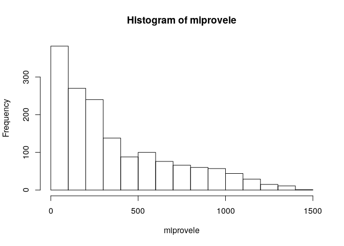

Unidad 1, asignación 2: exportar datos, leer ráster y extraer valores
=====================================================================

Sigo ayudando con `...`. Donde quiera que los veas, deberás sustituirlos por lo que indique el correspondiente mandato.

Dentro de las opciones de `knitr`, en el encabezado de este archivo, es probable que encuentres el argumento `eval = F`. Antes de tejer debes cambiarlo a `eval = T`, para que evalúe los bloques de código según tus cambios.

Provincia asignada
------------------

Toma nota del código de tu provincia asignada aleatoriamente.

``` r
 # abreviatura provaleatoria
 #       acade            11
 #       agrie            09
 #       aleir            10
 #       arqco            16
 #       cindy            12
 #       franc            23
 #       geora            08
 #       hoyod            22
 #       ingan            07
 #       ingdi            19
 #       itac9            15
 #       ivanv            25
 #       lbine            30
 #       leona            24
 #       magda            20
 #       maryj            02
 #       masue            26
 #       mmvol            13
 #       naui2            29
 #       rober            27
 #       wilne            06
 #       yoenn            21
```

Paquetes
--------

-   Carga el paquete `sf` y el paquete `raster`.

``` r
library(sf)
## Linking to GEOS 3.7.1, GDAL 2.4.2, PROJ 5.2.0
library(raster)
## Loading required package: sp
```

Exporta
-------

-   Determina el nombre de la capa provincias con `st_layers` del archivo GeoPackage que se encuentra en la carpeta `data`.

-   Carga la capa de provincias con la función `st_read`, asignándola al objeto `prov`.

-   Genera el objeto `miprov` que sólo contenga tu provincia.

-   Usando la función `st_write`, exporta el objeto `miprov` como GeoPackage a la carpeta `data` con el nombre `miprovexportado.gpkg`.

-   Lee el archivo exportado con la función `st_read` y asígnalo al objeto `miprovexportado`. Dado que sólo tiene una capa, no tienes que especificar el argumento `layer`.

-   Imprime en pantalla el objeto `miprovexportado` (sólo necesitas escribir el nombre del objeto).

``` r
st_layers('data/divisionRD.gpkg')
## Driver: GPKG 
## Available layers:
##      layer_name geometry_type features fields
## 1 PROVCenso2010       Polygon       32      4
## 2  MUNCenso2010       Polygon      155      5
## 3  REGCenso2010       Polygon       10      2
prov <- st_read(dsn = 'data/divisionRD.gpkg', layer = 'PROVCenso2010')
## Reading layer `PROVCenso2010' from data source `/home/yoenn/unidad-1-asignacion-2-rasters-y-exportar-datos-espaciales-yurbaez/data/divisionRD.gpkg' using driver `GPKG'
## Simple feature collection with 32 features and 4 fields
## geometry type:  MULTIPOLYGON
## dimension:      XY
## bbox:           xmin: 182215.8 ymin: 1933532 xmax: 571365.3 ymax: 2205216
## epsg (SRID):    32619
## proj4string:    +proj=utm +zone=19 +datum=WGS84 +units=m +no_defs
miprov <- prov[prov$PROV %in% '21', ]
st_write(obj = miprov, dsn = 'data/miprovexportado.gpkg', driver = 'gpkg')
## Writing layer `miprovexportado' to data source `data/miprovexportado.gpkg' using driver `gpkg'
## Writing 1 features with 4 fields and geometry type Multi Polygon.
miprovexportado <- st_read(dsn = 'data/miprovexportado.gpkg')
## Reading layer `miprovexportado' from data source `/home/yoenn/unidad-1-asignacion-2-rasters-y-exportar-datos-espaciales-yurbaez/data/miprovexportado.gpkg' using driver `GPKG'
## Simple feature collection with 1 feature and 4 fields
## geometry type:  MULTIPOLYGON
## dimension:      XY
## bbox:           xmin: 354135.1 ymin: 2015756 xmax: 394115.5 ymax: 2080005
## epsg (SRID):    32619
## proj4string:    +proj=utm +zone=19 +datum=WGS84 +units=m +no_defs
miprovexportado
## Simple feature collection with 1 feature and 4 fields
## geometry type:  MULTIPOLYGON
## dimension:      XY
## bbox:           xmin: 354135.1 ymin: 2015756 xmax: 394115.5 ymax: 2080005
## epsg (SRID):    32619
## proj4string:    +proj=utm +zone=19 +datum=WGS84 +units=m +no_defs
##   PROV REG     TOPONIMIA ENLACE                           geom
## 1   21  05 SAN CRISTÓBAL   0521 MULTIPOLYGON (((377168.7 20...
```

Ráster
------

-   Con la función `raster`, carga el modelo digital de elevaciones que se encuentra en la carpeta `data`. Es el único archivo de extensión `.tif` Asígnalo al objeto `mde`

-   Genera un mapa con la función `plot`, usando la paleta de colores `terrain.colors`.

``` r
mde <- raster('data/mde_rd.tif')
plot(mde, col = terrain.colors(n = 255))
```



Extraer valores del ráster
--------------------------

-   Con la función `raster::extract`, extrae los valores de elevación correspondientes a tu provincia. Utiliza `mde` como objeto ráster y `miprov` como capa zonal. Asigna los valores al objeto `miprovele`.

-   Imprime en pantalla el objeto `miprovele` (sólo necesitas escribir el nombre del objeto).

-   Obtén los estadísticos descriptivos básicos (mínimo, primer cuartil, media, mediana, tercer cuartil, máximo) de `miprovele` con la función `summary`.

-   Genera un histograma de `miprovele` usando la función `hist`.

``` r
miprovele <- raster::extract(mde, miprov)[[1]]
miprovele
##    [1]  544.859985  283.790009  345.700012  358.440002  335.630005
##    [6]  458.739990  351.529999  280.140015  273.109985  315.450012
##   [11]  286.920013  326.230011  479.459991  402.570007  358.309998
##   [16]  286.570007  264.049988  268.459991  266.600006  277.660004
##   [21]  328.100006  460.350006  577.809998  500.459991  501.440002
##   [26]  301.549988  261.500000  250.320007  252.139999  263.630005
##   [31]  312.869995  403.380005  760.109985  716.299988  576.489990
##   [36]  334.700012  287.450012  264.160004  245.220001  249.020004
##   [41]  263.589996  329.630005  487.570007  620.330017  630.950012
##   [46]  904.890015  542.299988  347.720001  283.209991  266.790009
##   [51]  244.000000  237.759995  248.639999  279.170013  381.450012
##   [56]  473.940002  415.859985  626.869995  824.940002  605.409973
##   [61]  358.980011  283.260010  264.220001  247.690002  236.660004
##   [66]  242.759995  301.470001  355.179993  328.369995  289.429993
##   [71]  362.690002  542.340027  849.309998  679.789978  482.980011
##   [76]  339.399994  295.609985  272.309998  261.700012  243.179993
##   [81]  238.009995  257.429993  242.059998  236.240005  234.110001
##   [86]  252.050003  366.820007  648.289978  879.210022  803.169983
##   [91]  825.700012  653.789978  481.070007  347.709991  273.750000
##   [96]  247.690002  234.809998  235.050003  275.679993  222.089996
##  [101]  209.869995  242.259995  336.880005  318.029999  569.190002
##  [106] 1067.290039  810.489990  749.859985  721.250000  864.669983
##  [111]  680.669983  409.579987  303.769989  264.010010  234.860001
##  [116]  232.570007  282.079987  236.330002  201.630005  231.750000
##  [121]  376.700012  414.790009  969.369995 1026.569946 1180.560059
##  [126] 1140.119995  897.219971  638.570007  538.169983  500.440002
##  [131]  710.090027  706.179993  450.410004  351.140015  289.750000
##  [136]  241.470001  228.520004  264.089996  253.830002  197.270004
##  [141]  222.759995  448.869995  548.440002  930.599976 1040.910034
##  [146] 1115.400024 1232.000000 1260.359985  985.250000  856.559998
##  [151]  692.750000  507.230011  474.739990  671.710022  546.159973
##  [156]  345.369995  273.750000  247.000000  230.550003  222.850006
##  [161]  210.470001  196.259995  190.690002  329.890015  477.869995
##  [166]  345.779999  262.899994  913.869995 1069.319946 1261.619995
##  [171] 1326.599976 1329.439941 1190.619995  932.989990  645.919983
##  [176]  508.299988  427.209991  437.570007  494.250000  404.420013
##  [181]  293.010010  259.470001  246.669998  233.630005  203.770004
##  [186]  196.380005  181.270004  203.919998  312.600006  278.799988
##  [191]  291.720001  900.479980 1024.709961 1236.739990 1383.790039
##  [196] 1390.160034 1173.000000  892.690002  657.840027  762.739990
##  [201]  640.590027  395.619995  401.559998  358.470001  329.899994
##  [206]  301.040009  274.839996  250.889999  260.799988  198.229996
##  [211]  178.630005  171.179993  200.320007  204.699997  243.679993
##  [216]  890.960022  974.729980 1105.390015 1220.719971 1361.920044
##  [221] 1332.449951 1008.090027  873.780029  865.950012  598.570007
##  [226]  440.070007  599.150024  688.609985  588.760010  417.859985
##  [231]  294.049988  278.200012  274.440002  219.309998  172.380005
##  [236]  165.289993  163.070007  182.139999  217.949997  958.059998
##  [241] 1006.979980 1017.419983 1101.459961 1277.890015 1282.089966
##  [246] 1173.209961 1129.880005 1023.799988  787.369995  593.130005
##  [251]  546.929993  753.299988  612.059998  536.630005  351.209991
##  [256]  289.410004  229.919998  200.800003  166.350006  159.860001
##  [261]  155.910004  174.839996  229.240005  166.949997  884.349976
##  [266] 1042.810059 1103.680054 1154.530029 1145.359985 1130.109985
##  [271] 1125.189941 1222.829956 1141.890015  994.780029  952.179993
##  [276]  707.840027  666.890015  788.390015  669.750000  453.630005
##  [281]  320.450012  269.429993  225.389999  208.089996  165.050003
##  [286]  154.479996  150.470001  160.360001  192.669998  155.759995
##  [291]  832.340027  933.169983 1115.699951 1269.630005 1332.920044
##  [296] 1197.739990 1087.939941 1033.770020 1119.599976 1099.260010
##  [301]  973.770020  810.609985  647.190002  882.849976  733.989990
##  [306]  580.099976  507.149994  368.450012  276.459991  287.130005
##  [311]  294.290009  181.360001  149.740005  144.539993  145.729996
##  [316]  190.089996  158.490005  834.559998  930.080017 1045.150024
##  [321] 1217.319946 1348.489990 1288.099976 1180.300049 1052.579956
##  [326] 1013.799988 1021.109985  926.119995  793.119995  841.099976
##  [331]  965.820007  741.140015  547.909973  433.750000  439.359985
##  [336]  339.000000  348.390015  246.860001  215.919998  153.940002
##  [341]  137.020004  144.800003  177.899994  183.220001  146.610001
##  [346]  824.429993  978.869995 1177.359985 1347.099976 1361.329956
##  [351] 1272.170044 1256.660034 1117.609985 1010.950012 1001.640015
##  [356]  996.080017 1059.609985 1087.650024 1038.410034  736.059998
##  [361]  520.369995  411.119995  408.809998  516.739990  430.149994
##  [366]  313.350006  241.050003  185.539993  133.570007  135.570007
##  [371]  154.910004  187.360001  152.869995  826.799988  884.099976
##  [376] 1153.819946 1419.819946 1335.900024 1157.160034 1200.140015
##  [381] 1149.939941 1047.859985  974.429993 1001.260010 1020.609985
##  [386] 1115.180054 1014.340027  735.559998  649.940002  504.160004
##  [391]  350.940002  435.119995  461.209991  265.940002  291.940002
##  [396]  202.639999  138.320007  128.479996  152.100006  180.350006
##  [401]  172.110001  119.900002  819.030029  980.760010 1214.930054
##  [406] 1182.900024  994.619995  980.309998  943.289978  998.539978
##  [411]  975.640015 1000.330017  906.030029  753.059998  924.109985
##  [416]  840.469971  670.830017  526.780029  362.369995  335.890015
##  [421]  424.339996  244.800003  213.759995  212.050003  144.830002
##  [426]  125.480003  146.139999  200.070007  917.900024 1062.969971
##  [431] 1029.250000  851.859985  846.580017  982.299988 1058.709961
##  [436] 1078.229980 1075.339966  985.210022  762.849976  642.280029
##  [441]  647.479980  575.859985  453.250000  330.119995  358.329987
##  [446]  393.440002  244.009995  186.460007  188.929993  154.220001
##  [451]  146.880005  125.169998  165.360001  792.840027  971.590027
##  [456]  900.760010  747.359985  807.619995  916.109985 1028.280029
##  [461] 1154.109985 1150.900024 1052.319946  944.650024  721.280029
##  [466]  531.359985  412.579987  367.100006  355.109985  261.670013
##  [471]  212.130005  214.860001  189.770004  170.509995  176.889999
##  [476]  176.389999  122.610001  140.259995  183.679993  678.890015
##  [481]  860.760010 1004.559998  866.599976  707.969971  723.950012
##  [486]  752.049988  845.219971  962.679993  931.849976  924.979980
##  [491]  988.330017  852.570007  683.229980  517.679993  472.649994
##  [496]  372.959991  336.589996  238.389999  175.399994  189.880005
##  [501]  177.039993  163.809998  146.490005  132.139999  124.269997
##  [506]  868.840027 1001.049988  945.169983  779.119995  634.299988
##  [511]  712.419983  863.590027  990.429993  980.940002  852.140015
##  [516]  738.030029  670.900024  729.030029  689.020020  579.219971
##  [521]  484.320007  391.470001  278.429993  203.729996  203.729996
##  [526]  157.130005  146.750000  141.479996  136.539993  122.830002
##  [531]  642.500000  822.090027  978.289978  923.340027  805.799988
##  [536]  689.950012  629.570007  739.940002  872.780029 1020.440002
##  [541] 1025.510010  914.719971  718.669983  546.650024  518.270020
##  [546]  533.609985  470.000000  386.170013  282.290009  271.420013
##  [551]  309.739990  214.369995  187.690002  176.020004  155.449997
##  [556]  148.309998  657.380005  880.419983  989.530029  948.530029
##  [561]  860.859985  703.559998  596.119995  597.419983  669.690002
##  [566]  877.469971 1028.650024  877.119995  722.929993  573.099976
##  [571]  438.369995  389.779999  336.950012  374.739990  438.390015
##  [576]  544.010010  372.250000  246.210007  223.460007  165.880005
##  [581]  138.389999  130.899994  116.389999  576.679993  736.109985
##  [586]  875.130005  975.710022 1018.619995  930.250000  779.989990
##  [591]  569.429993  648.159973  679.929993  722.039978  859.469971
##  [596]  840.859985  694.679993  589.400024  588.000000  463.529999
##  [601]  385.809998  451.049988  505.209991  489.380005  419.989990
##  [606]  336.559998  226.619995  186.750000  143.949997  128.949997
##  [611]  136.470001  730.409973  798.900024  878.349976  868.159973
##  [616]  806.539978  759.440002  549.570007  682.349976  795.010010
##  [621]  814.049988  791.190002  703.049988  666.500000  626.369995
##  [626]  575.690002  518.440002  451.459991  597.190002  567.289978
##  [631]  390.059998  301.790009  240.860001  198.470001  170.610001
##  [636]  148.830002  139.139999  133.639999  112.279999   92.480003
##  [641]  587.659973  714.349976  909.820007  957.229980  729.549988
##  [646]  615.099976  596.390015  517.690002  622.150024  745.260010
##  [651]  949.599976  861.450012  683.859985  599.859985  546.799988
##  [656]  520.190002  481.420013  473.420013  542.869995  528.549988
##  [661]  414.700012  349.540009  297.510010  277.350006  206.779999
##  [666]  173.089996  150.529999  120.480003  105.910004  100.180000
##  [671]  571.280029  771.500000  928.909973  895.880005  896.599976
##  [676]  740.950012  559.989990  470.339996  551.260010  775.770020
##  [681]  839.299988  927.450012  844.400024  732.479980  668.460022
##  [686]  610.020020  564.320007  506.029999  466.929993  409.010010
##  [691]  332.130005  372.000000  412.119995  404.470001  262.940002
##  [696]  187.479996  182.679993  141.339996  117.400002  106.870003
##  [701]  554.270020  597.640015  718.710022  764.500000  945.380005
##  [706]  830.450012  749.030029  525.340027  466.579987  604.929993
##  [711]  654.619995  763.020020  747.969971  705.039978  697.030029
##  [716]  601.130005  529.280029  546.289978  456.500000  335.339996
##  [721]  312.109985  353.489990  383.100006  358.489990  276.250000
##  [726]  223.779999  177.740005  154.020004  122.610001  118.339996
##  [731]   98.199997  534.969971  669.500000  795.909973  873.000000
##  [736]  732.700012  604.349976  507.470001  454.100006  541.739990
##  [741]  692.159973  659.239990  554.070007  521.789978  470.929993
##  [746]  423.910004  485.989990  459.769989  325.899994  263.720001
##  [751]  281.989990  302.869995  399.429993  336.170013  244.300003
##  [756]  208.660004  164.250000  114.320000   90.730003   51.209999
##  [761]  478.950012  734.419983  791.479980  717.469971  696.859985
##  [766]  567.690002  485.220001  430.059998  489.899994  545.039978
##  [771]  647.260010  593.280029  549.000000  489.359985  419.420013
##  [776]  354.200012  386.829987  345.369995  317.790009  238.309998
##  [781]  258.049988  310.980011  341.019989  297.200012  243.369995
##  [786]  168.479996  123.769997   94.379997   87.919998   83.370003
##  [791]   77.209999   63.029999   50.880001  614.770020  650.080017
##  [796]  502.190002  616.580017  519.549988  439.209991  530.169983
##  [801]  538.599976  523.820007  595.979980  565.049988  452.429993
##  [806]  417.559998  383.390015  362.040009  305.279999  343.359985
##  [811]  348.519989  259.510010  218.229996  264.220001  311.850006
##  [816]  277.079987  224.669998  189.779999  174.889999  141.119995
##  [821]  121.320000  152.270004  133.169998   72.190002   57.799999
##  [826]   39.869999  489.679993  457.470001  501.890015  405.149994
##  [831]  531.190002  640.700012  714.369995  695.409973  608.549988
##  [836]  635.349976  577.309998  505.459991  409.170013  348.290009
##  [841]  301.010010  264.790009  278.000000  264.880005  235.029999
##  [846]  216.800003  323.799988  304.820007  227.339996  183.660004
##  [851]  154.110001  143.550003  164.050003  146.300003  135.339996
##  [856]   76.059998   62.240002   44.349998  411.559998  446.269989
##  [861]  502.779999  734.809998 1032.050049  957.719971  792.710022
##  [866]  723.710022  654.929993  507.239990  392.459991  353.970001
##  [871]  328.329987  315.350006  265.329987  283.609985  291.959991
##  [876]  223.279999  335.440002  277.989990  219.080002  218.160004
##  [881]  200.000000  208.889999  164.220001  128.229996   96.150002
##  [886]   60.730000   56.459999   45.029999  397.130005  633.570007
##  [891]  949.969971 1070.719971 1078.599976  919.900024  696.210022
##  [896]  558.039978  578.909973  598.190002  451.799988  376.899994
##  [901]  311.859985  293.149994  218.070007  263.980011  279.880005
##  [906]  278.980011  182.839996  184.080002  221.559998  209.580002
##  [911]  163.619995  126.919998   98.430000   77.459999   65.739998
##  [916]   37.279999   25.090000  412.510010  578.969971  899.830017
##  [921] 1142.349976 1076.030029  820.450012  628.140015  697.940002
##  [926]  661.119995  557.570007  534.500000  482.320007  468.799988
##  [931]  324.109985  263.510010  188.759995  146.399994  193.839996
##  [936]  159.539993  131.029999  162.860001  173.169998  151.720001
##  [941]  110.980003   82.250000   54.070000   27.610001  358.820007
##  [946]  764.429993  882.989990  877.219971  883.289978  661.859985
##  [951]  656.900024  577.770020  414.429993  390.190002  370.829987
##  [956]  456.260010  401.779999  326.890015  238.759995  209.410004
##  [961]  249.490005  299.920013  166.080002  115.320000  141.130005
##  [966]  125.730003   96.360001   78.690002   63.580002   83.669998
##  [971]   42.419998   22.240000   10.630000  410.519989  650.109985
##  [976]  595.109985  616.590027  729.789978  618.390015  711.570007
##  [981]  601.770020  411.010010  317.799988  286.320007  311.869995
##  [986]  335.809998  267.510010  287.679993  241.470001  262.709991
##  [991]  264.140015  196.529999  121.940002   89.699997   71.300003
##  [996]  103.480003  113.370003  109.889999   72.879997   31.330000
## [1001]   17.580000   29.400000   19.840000   11.020000  340.649994
## [1006]  353.350006  561.150024  474.880005  660.630005  656.070007
## [1011]  379.179993  292.519989  225.949997  214.970001  243.449997
## [1016]  180.039993  212.080002  270.079987  193.690002  166.860001
## [1021]  151.460007  113.150002   77.139999   90.839996  133.149994
## [1026]  152.110001  100.239998   66.379997   53.180000   48.169998
## [1031]   53.180000   50.880001   37.700001   28.950001   14.980000
## [1036]    8.510000  259.649994  470.859985  365.260010  516.390015
## [1041]  600.070007  371.720001  276.500000  235.190002  202.619995
## [1046]  194.410004  149.880005  194.910004  200.440002  162.630005
## [1051]  104.129997  111.029999   81.580002   59.340000  177.669998
## [1056]  162.679993  108.760002   87.220001   70.410004   59.070000
## [1061]   51.110001   61.779999   57.400002   51.630001   54.660000
## [1066]   51.180000   22.410000  257.429993  384.470001  303.549988
## [1071]  399.130005  431.769989  369.890015  332.279999  264.309998
## [1076]  267.519989  200.600006  154.240005  143.940002  155.350006
## [1081]  125.790001  104.589996   89.900002   74.500000   49.090000
## [1086]   88.449997   91.930000   87.139999   70.150002   58.889999
## [1091]   61.389999   54.279999   50.660000   50.009998   59.959999
## [1096]   60.310001   45.169998   20.600000  274.559998  213.720001
## [1101]  245.470001  253.529999  357.899994  382.549988  288.350006
## [1106]  220.919998  196.279999  186.130005  125.610001  102.220001
## [1111]   97.930000   96.860001   77.099998   63.630001   44.130001
## [1116]   45.480000   49.230000   66.959999   75.370003   56.410000
## [1121]   43.290001   41.509998   41.570000   47.150002   56.599998
## [1126]   55.889999   37.480000   12.720000  157.399994  173.750000
## [1131]  215.820007  282.170013  353.440002  251.210007  229.679993
## [1136]  244.369995  206.100006  159.759995  113.629997   89.760002
## [1141]   76.470001   65.480003   54.849998   48.700001   38.389999
## [1146]   37.070000   43.439999   76.750000   67.550003   57.980000
## [1151]   47.700001   39.070000   42.060001   65.699997   48.070000
## [1156]   20.680000  188.940002  253.610001  256.459991  279.640015
## [1161]  294.369995  259.019989  235.500000  204.889999  166.009995
## [1166]  119.449997  122.599998   74.650002   62.759998   60.419998
## [1171]   76.650002   44.970001   34.459999   31.490000   58.369999
## [1176]   66.209999   62.110001   60.830002   28.059999   57.599998
## [1181]   55.619999   27.520000  149.000000  149.479996  186.580002
## [1186]  286.489990  311.609985  373.019989  381.790009  283.359985
## [1191]  220.970001  221.910004  215.270004  197.779999  144.570007
## [1196]   94.529999   83.389999   89.080002   83.419998   44.759998
## [1201]   32.860001   29.809999   45.840000   58.889999   60.250000
## [1206]   61.180000   40.669998   66.250000   42.110001   13.562500
## [1211]  158.009995  151.330002  160.119995  200.460007  268.959991
## [1216]  299.540009  374.320007  555.770020  558.250000  382.540009
## [1221]  366.739990  367.790009  311.570007  219.320007  131.559998
## [1226]  108.349998   95.739998   88.690002   93.800003   52.250000
## [1231]   32.200001   26.889999   36.490002   43.840000   55.779999
## [1236]   67.879997   49.119999   44.459999   24.110001   16.750000
## [1241]  173.690002  359.010010  325.209991  247.500000  248.880005
## [1246]  244.160004  267.859985  379.059998  478.260010  446.630005
## [1251]  350.570007  298.290009  223.059998  192.770004  146.039993
## [1256]  109.639999   97.970001   83.849998   72.839996   72.750000
## [1261]   67.150002   76.660004   57.880001   27.450001   37.110001
## [1266]   39.970001   57.810001   38.599998   19.320000   14.900000
## [1271]  116.739998  234.460007  372.859985  346.730011  222.639999
## [1276]  216.110001  257.910004  332.809998  301.130005  347.950012
## [1281]  264.100006  196.179993  165.160004  143.529999  117.190002
## [1286]  104.809998  105.139999   95.669998   73.300003   64.699997
## [1291]   70.290001  102.610001   98.720001   57.549999   51.630001
## [1296]   44.290001   23.260000   22.559999   12.330000  142.759995
## [1301]  215.279999  281.600006  212.729996  256.279999  257.779999
## [1306]  313.010010  260.739990  245.779999  208.910004  198.320007
## [1311]  166.940002  138.960007  112.900002   91.070000   84.500000
## [1316]   91.080002   74.680000   56.110001   52.560001   56.669998
## [1321]   77.750000   75.529999   59.970001   39.110001   10.750000
## [1326]   12.580000    8.234042   99.550003  105.360001   96.919998
## [1331]  155.220001  234.330002  206.919998  322.350006  243.080002
## [1336]  180.750000  153.929993  132.080002  128.139999  115.040001
## [1341]  102.080002   97.339996   74.139999   75.540001   75.480003
## [1346]   62.740002   59.240002   69.730003   68.529999   55.799999
## [1351]   35.880001   31.520000   12.890000    4.712121   82.750000
## [1356]  102.489998  155.029999  185.740005  285.329987  212.320007
## [1361]  154.000000  120.489998  104.059998  119.360001   97.959999
## [1366]   82.949997   85.730003   70.250000   58.480000   64.309998
## [1371]   64.690002   95.690002  119.820000  103.629997   92.720001
## [1376]   42.860001   13.990000   11.180851   64.239998  102.570000
## [1381]  169.020004  215.960007  152.940002  124.220001  140.919998
## [1386]   86.769997   91.470001   84.330002   75.400002   64.919998
## [1391]   57.709999   51.160000   47.119999   85.110001  117.820000
## [1396]  116.440002  109.379997   86.820000   38.830002   15.010000
## [1401]   58.200001   82.529999  143.350006  126.860001  109.050003
## [1406]  105.769997   97.970001   75.639999   69.739998   67.110001
## [1411]   77.919998   67.059998   58.220001   44.520000   38.669998
## [1416]  105.599998  131.169998  112.260002  101.830002   79.980003
## [1421]   32.509998   15.455696   56.750000   68.849998   76.589996
## [1426]  101.949997  100.120003   81.110001   66.989998   55.830002
## [1431]   54.919998   70.910004   98.449997  111.589996   96.879997
## [1436]   72.690002   61.950001  113.150002  122.720001   99.849998
## [1441]   61.950001   26.580000   49.049999   67.500000   89.209999
## [1446]   80.839996   70.550003   63.619999   46.919998   52.560001
## [1451]   99.500000  137.050003  101.820000  104.760002   81.589996
## [1456]   58.000000   95.629997  104.040001   78.269997   37.750000
## [1461]   22.180851   55.990002   70.050003   56.380001   68.620003
## [1466]   51.230000   41.349998   68.550003  135.169998  115.750000
## [1471]   97.970001   93.220001   86.610001   88.209999   75.379997
## [1476]   80.800003   51.759998   28.040001   40.529999   42.860001
## [1481]   45.160000   70.879997   38.110001   47.090000  126.089996
## [1486]  125.040001  121.699997  107.989998   87.300003   77.570000
## [1491]   74.199997   51.419998   28.299999   27.610001   19.604939
## [1496]   32.860001   34.770000   37.169998   34.139999  113.739998
## [1501]  123.489998  104.849998  102.129997  119.839996  100.440002
## [1506]   73.839996   54.599998   28.540001   12.752809   17.089888
## [1511]   31.590000   30.520000   48.310001  127.220001  128.330002
## [1516]   92.919998   93.290001  109.669998   89.040001   68.830002
## [1521]   35.240002   16.255814   28.260000   26.490000   59.770000
## [1526]  130.919998  114.019997  100.470001   93.040001   74.540001
## [1531]   67.839996   46.459999   23.750000   16.000000   35.119999
## [1536]   87.519997  100.870003   95.199997   80.889999   62.220001
## [1541]   40.669998   25.530001   17.258064   72.059998   89.449997
## [1546]   80.360001   68.949997   52.419998   33.669998   16.474226
## [1551]   44.849998   62.040001   57.810001   50.580002   35.639999
## [1556]   22.054945   12.940000   24.879999   47.230000   48.080002
## [1561]   33.110001   23.490000   10.060000   25.240000   36.450001
## [1566]   35.590000   24.639999   17.000000    6.170000    8.010000
## [1571]   16.770000   22.920000   18.299999    3.857143    3.865385
## [1576]   11.179487   15.014085
summary(miprovele)
##     Min.  1st Qu.   Median     Mean  3rd Qu.     Max. 
##    3.857  102.490  257.780  368.227  564.320 1419.820
hist(miprovele)
```


